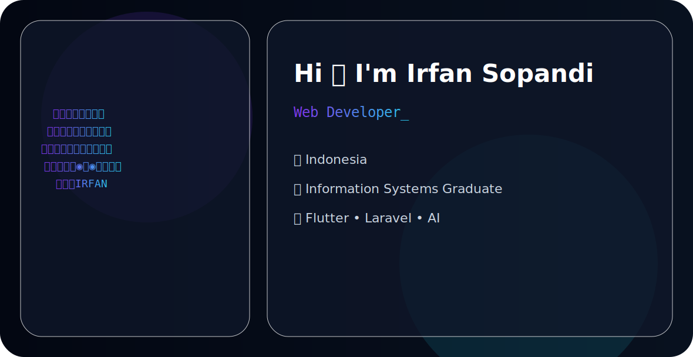

# Irfan Sopandi

<!-- PREMIUM ANIMATED BANNER (Otomatis ganti Dark/Light Mode) -->
<picture>
  <source media="(prefers-color-scheme: dark)" srcset="assets/dark.svg">
  <source media="(prefers-color-scheme: light)" srcset="assets/light.svg">
  
</picture>

 

## 👋 About Me

I'm a **5th-semester Information Systems student** passionate about crafting exceptional digital experiences through **web development** and **UI/UX design**[cite: 2]. I specialize in building scalable, user-centered applications that solve real-world problems with clean code and intuitive interfaces[cite: 2].

🎯 **Current Focus**: Full-stack web development with Laravel & modern frontend technologies[cite: 2]  
📍 **Location**: Karawang, Indonesia[cite: 2]  
📧 **Email**: irfansopandi1212@gmail.com[cite: 2]  

---

## 🛠️ Technical Skills

### **Web Development**

### **Mobile Development**

### **Design & Tools**

---

## 🌟 Featured Projects

### 🎵 Five Fest
**Web Platform for Music Festival & Concert Management**[cite: 2]  

A comprehensive digital platform transforming how music events are managed and experienced[cite: 2].

* **🎫 Ticketing System**: Secure online ticket purchases with Midtrans integration[cite: 2]
* **👕 Merchandise Store**: Official event merchandise sales platform[cite: 2]
* **🏪 UMKM Portal**: Tenant registration and management for local businesses[cite: 2]
* **🎪 Vendor Management**: Streamlined vendor onboarding and coordination[cite: 2]
* **🎵 Spotify Integration**: Artist discovery and playlist sharing via Spotify API[cite: 2]
* **👨‍💼 Admin Dashboard**: Comprehensive event analytics and management controls[cite: 2]

---

### 🆘 SIGANA
**Disaster Response Information System & Donation Platform**[cite: 2]  

[]

A critical platform enabling efficient disaster management, donation tracking, and volunteer coordination[cite: 2].

* **📢 Incident Reporting**: Real-time disaster event documentation and mapping[cite: 2]
* **💰 Online Donations**: Secure payment processing with transparent fund allocation[cite: 2]
* **👥 Volunteer Management**: Complete lifecycle from registration to certification[cite: 2]

---

### 💰 Money Manager App
**Personal Finance Management Mobile Application**[cite: 2]  
[]
[]

An intuitive mobile solution empowering users to take control of their financial wellbeing[cite: 2].

* **💳 Transaction Tracking**: Income and expense categorization with visual analytics[cite: 2]
* **📊 Financial Dashboard**: Real-time balance overview and spending insights[cite: 2]
* **🌓 Dark Mode**: Eye-friendly interface for reduced strain during night usage[cite: 2]

---

## 📈 GitHub Stats

  
  

---

## 🤝 Let's Connect

I'm always open to collaborating on interesting projects, discussing technology, or exploring new opportunities in web development and UI/UX design[cite: 2].

* 🔗 **LinkedIn**: [linkedin.com/in/irfansopandi](https://linkedin.com/in/irfansopandi)[cite: 2]
* 🐦 **Twitter**: [twitter.com/irfansopandi](https://twitter.com/irfansopandi)[cite: 2]

💡 **Let's build something amazing together!**[cite: 2]

---

<i>Last updated: July 2026</i>
